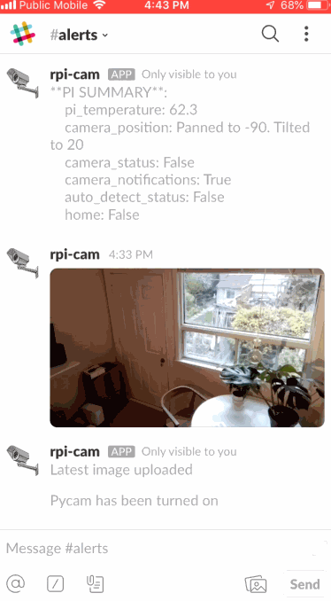
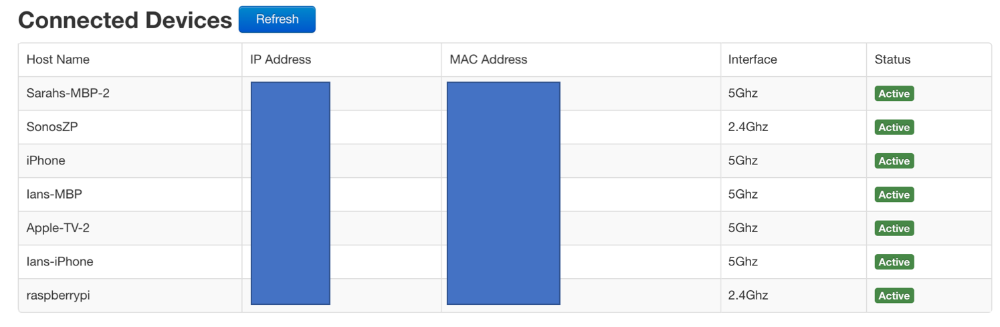
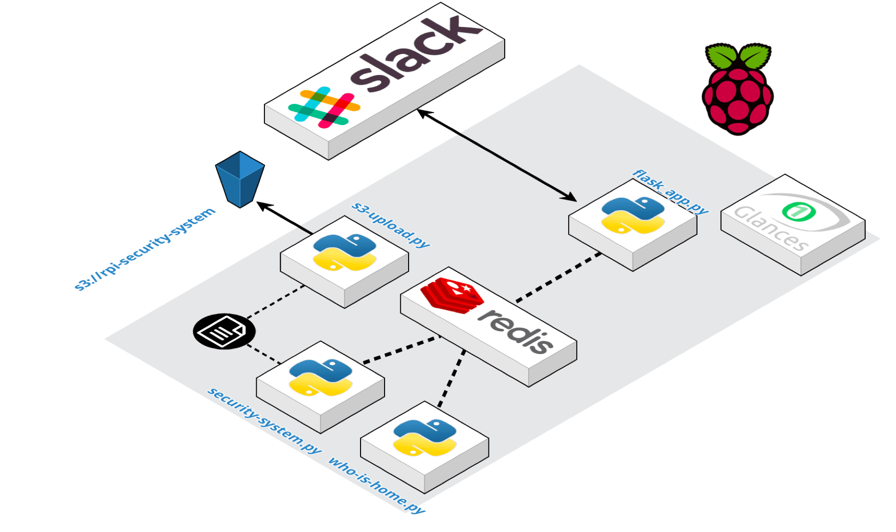
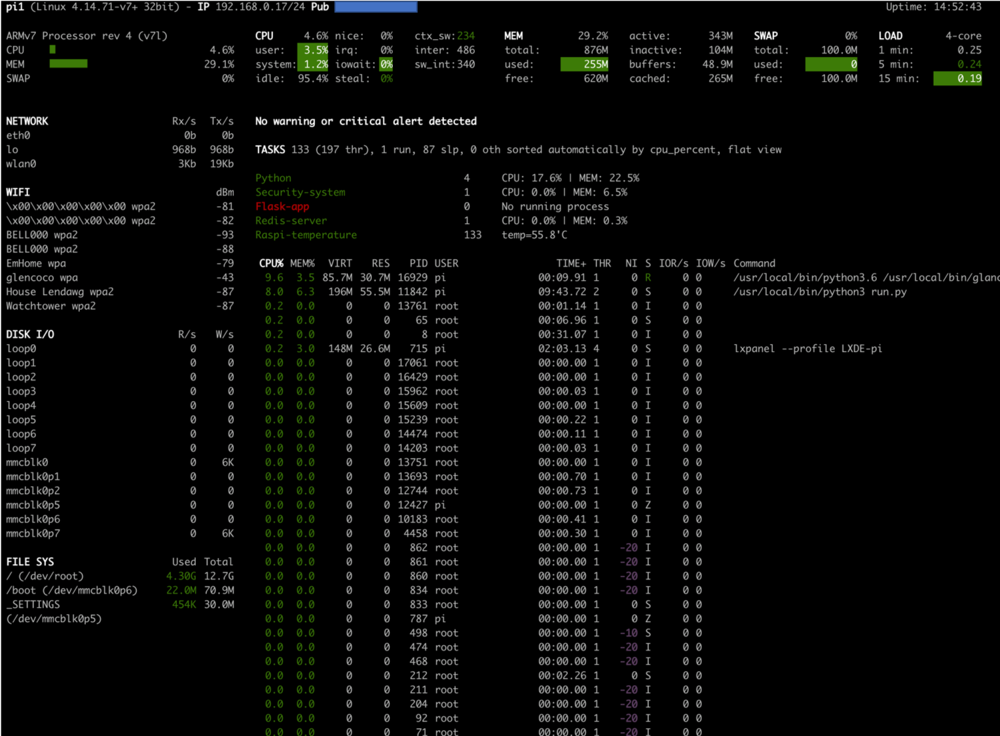
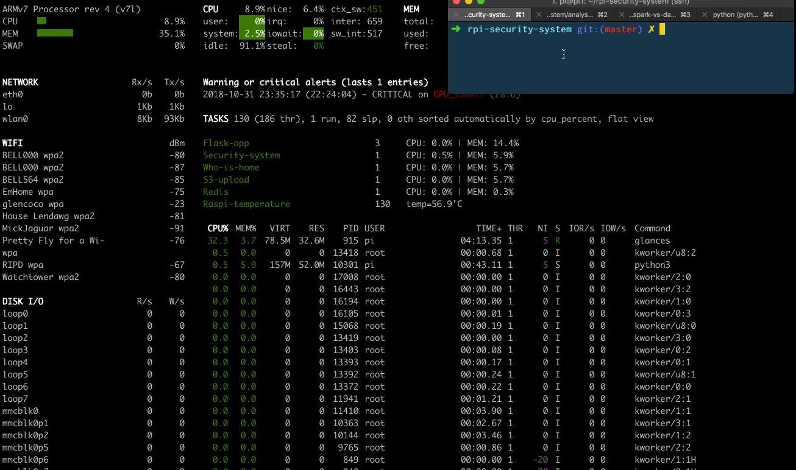

# rpi-security-system


Hacking a home security system with a raspberry pi + Python.

## Demo

Slack is used as a control system, to get current information about the system, retrieve the latest image taken, or turn the system on/off.


Other things like disabling notifications, automatically turning the system on/off based on who is home, or panning/tilting the camera can also be controlled through slack.

Moving the camera is accomplished by adding a [Pan-Tilt Hat](https://shop.pimoroni.com/products/pan-tilt-hat). With a simple slack slash command, i.e. `/rotate 30 20`, the camera can be panned to position 30 and tilted to position 20.


When motion is detected, an alert is triggered in slack. If the system is in training mode, it will also prompt for the user to tag whether the image is occupied or not. The response is logged and save for future model tuning.



## How it Works

### Motion Detection

Motion detection is accomplished using a method known as background substraction. In background substraction, you store a model of the "background" (whatever your system looks like when there is no motion), and then you compare new images to this background. If there is a large enough difference, you can infer that it was caused by some type of motion. 

For simplicity, the background model is a simple running average of all frames seen by the raspberry pi. This is less computationally expensive than more advanced background modelling methods, as discussed [here](https://www.pyimagesearch.com/2015/05/25/basic-motion-detection-and-tracking-with-python-and-opencv/).

To illustrate an example of this, consider the following background model image:


**Note:** The background image is a blurred, black and white image. Blurring helps reduce noise, while working with black and white images is less computationally heavy. RGB values don't add much value in motion detection.

Next, we take our latest frame,


then blur it and convert it to black and white so it can be compared to our background image.


Taking the difference between the two frames yields the following "delta" image:


Next, we threshold (or binarize) the image, by converting all pixels above/below a certain threshold to white or black. 


Dilation is then performed to close any gaps. Dilation involves moving a sliding window (kernel) over an image, and updating a given pixel's value based on the surrounding pixels.


From this thresholded, dilated difference, you can see if the area of the white blobs is greater than a certain threshold, and trigger motion based of that.

You can see how all this is layered together in the demo below.


**Note:** This method of background substraction was entirely based off of a blog post by Adrian Rosebrock over at pyimagesearch.com. Check out the references section at the bottom for a link to his post.

### Slack Interface
Slack was used as an interface to the security system since it has a fantastic API, works excellently on mobile and desktop, and removed the need for me to make a GUI.

After creating my slack app, I set up a bunch of [slash commands](https://api.slack.com/slash-commands), each of which corresponds to an endpoint in a flask API.

For example, entering `/pycam_on` in slack triggers this function in my flask application:

```python
@app.route('/pycam_on', methods=["POST"])
@slack_verification()
def pycam_on():
    """Turn on the pycam process.

    Returns:
        str: Response to slack
    """
    if utils.redis_get('camera_status'):
        response = 'Pycam is already running'
    else:
        utils.redis_set('camera_status', True)
        response = "Pycam has been turned on"
    return response
```

The `@slack_verification()` decorator ensures the request is coming from slack, since slack sends a unique, private token with each request.

All system settings are stored in a local [redis](https://redis.io/) database, which allows for communication between the different python processes running on the raspberry pi (more on this in the next section).


Slack apps also allow for other forms of interactivity, like when I click one of the occupied/unoccupied buttons associated with an image, the following function is called.

```python
@app.route('/interactive', methods=["POST"])
def interactive():
    """This function is triggered after one of the buttons is clicked in slack
    (i.e. the occupied/unoccupied buttons)

    Returns:
        str: Response to slack
    """
    data = utils.parse_slash_post(request.form)

    # grab some metadata associated with the message that was
    # interacted with
    payload = json.loads((data['payload']))
    action = payload['actions'][0]
    action_value = eval(action['value'])
    tag = action_value['occupied']
    img_filename = action_value['filename']

    # Save an empty file with the logged tag
    filename = "{}_{}.txt".format(tag, img_filename.replace('.jpg', ''))
    filepath = os.path.join(config.TRAIN_DIR, filename)
    open(filepath, 'w').close()

    utils.slack_delete_file(action_value['file_id'])
    return 'Response for {} logged'.format(img_filename)
```

This function checks whether I clicked the "Occupied" or "Unoccupied" button for a given message, and stores my choice, along with the associated image filename, in an empty text file.

### Automatically turning the system on and off

Because I didn't want to be constantly turning the security system on/off whenever I left the house or got home, I needed a way for the system to automatically know whether I was at home. 

When playing with my router to set up the port forwarding to my raspberry pi, I noticed it had a page where it showed all the connected devices:



Under the hood, the webpage for my router was making an API call to retrive this information. After digging through the network requests being made to my router with Chrome's developer tools, I was able to re-create this API call in python.

```python
import requests

# Create a new requests session
session = requests.session()

# Call the login API with my credentials
response = session.post('<router_login_api_url>', LOGIN_DATA)

# Update my cookie with the new, authenticated user_id
user_str = response.headers['Set-Cookie']
user_id = user_str.split(';')[0].split('userid=')[1]
new_cookie = BASE_COOKIE.format(USERNAME, PWD, user_id)
headers['Cookie'] = new_cookie

# Call api and get connected devices
response = session.get('<get_connected_devices_api_url>', headers=headers)
devices = response.json()
connected_devices = [d['hostName'] for d in devices]
```

Using this information, I can conclude that either me or my girlfriend is at home if one of our iphones is connected to the wifi, and use that information to turn the security system on or off.

### Architecture

The following diagram shows all the running processes on the raspberry pi. Note, only the flask app and security system processes are required to have a working home security system.



The role of each process is as follows:

1) The flask app handles incoming requests from slack.
    - the flask app generally communicates with the redis database to answer questions like: "Is the security system set to ON", "Are notifications turned ON", or to change any of those values

2) The security system process has the code which is processing each frame from the camera, and performing background substraction. whenever motion is detected, a slack notification is triggered.
    - the security system is also constantly checking the `'camera_status'` variable in the redis database to see if it should continue running, or shutdown
    - A shutdown can be triggered manually, by a user running `/pycam_off` in slack, or automatically by the `who_is_home` process

3) The who_is_home process is constantly checking what devices are connected to the router, and updating the redis database accordingly.
    - If no one is home, the process will update the variable in the redis database (`'camera_status'`) to ensure the security system is running. Similarly, if someone is home, the process will update the variable in order to turn the system off 

4) The s3_upload process runs every 5 minutes and uploads any logged training data to S3

5) A [glances](https://github.com/nicolargo/glances) webserver runs so I can easily check/monitor all the running processes on my pi. More on glances below.

### System Monitoring with Glances

The glances webserver provides a pretty slick system dashboard, which can be easily viewed on a desktop browser or a mobile device. As discussed in `setup.md`, I configured the `glances.conf` file to watch for a few processes.



You can see I don't have a flask process running, which is flagged in red due to the `count_min=1` constraint in the glances config.

**Glances in Action**

You can see the power of glances in action, as I manually kill a process and restart it.



### Reducing False Positives with a Pre-Trained Image Classifier

Things like shadows or rapid lighting changes can trigger false positives with the background subtraction method. In order to minimize these false positives, the use of a pre-trained image classifier was explored.

Results coming soon...

## Setup

Check out `setup.md` for a detailed writeup.

## Usage

After completing all the steps documented in `setup.md`, you can SSH into your pi and run the following.

```bash
cd rpi-security-system

# Start flask app, security system and who_is_home
nohup gunicorn -c gunicorn.conf run_flask &
nohup python3 app/security_system.py >> app/logs/security_system.log &
nohup python3 app/who_is_home.py >> app/logs/who_is_home.log 2>&1 &

# start glances for system monitoring
nohup glances -w -p 52962 --disable-plugin docker --password &
```

## Resources

1) [Open CV Installation](https://www.pyimagesearch.com/2016/04/18/install-guide-raspberry-pi-3-raspbian-jessie-opencv-3/)
2) [General camera usage](https://www.pyimagesearch.com/2015/03/30/accessing-the-raspberry-pi-camera-with-opencv-and-python/)
3) [Intro to Motion Detection](https://www.pyimagesearch.com/2015/05/25/basic-motion-detection-and-tracking-with-python-and-opencv/)
4) [Motion detection system](https://www.pyimagesearch.com/2015/06/01/home-surveillance-and-motion-detection-with-the-raspberry-pi-python-and-opencv/)
5) [Creating slack apps](https://api.slack.com/slack-apps)
6) [Flask Video Streaming](https://blog.miguelgrinberg.com/post/flask-video-streaming-revisited)
