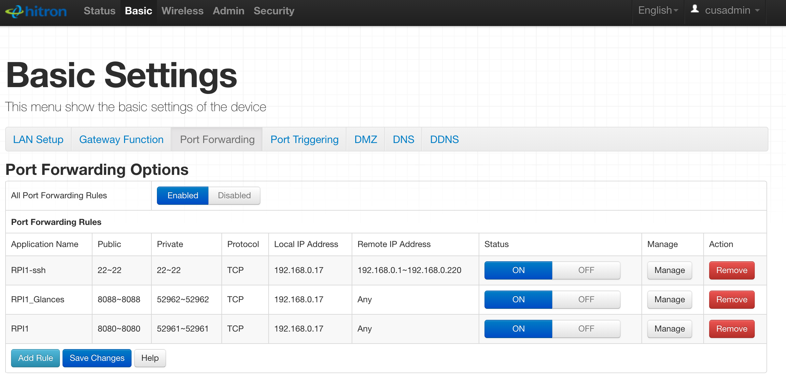
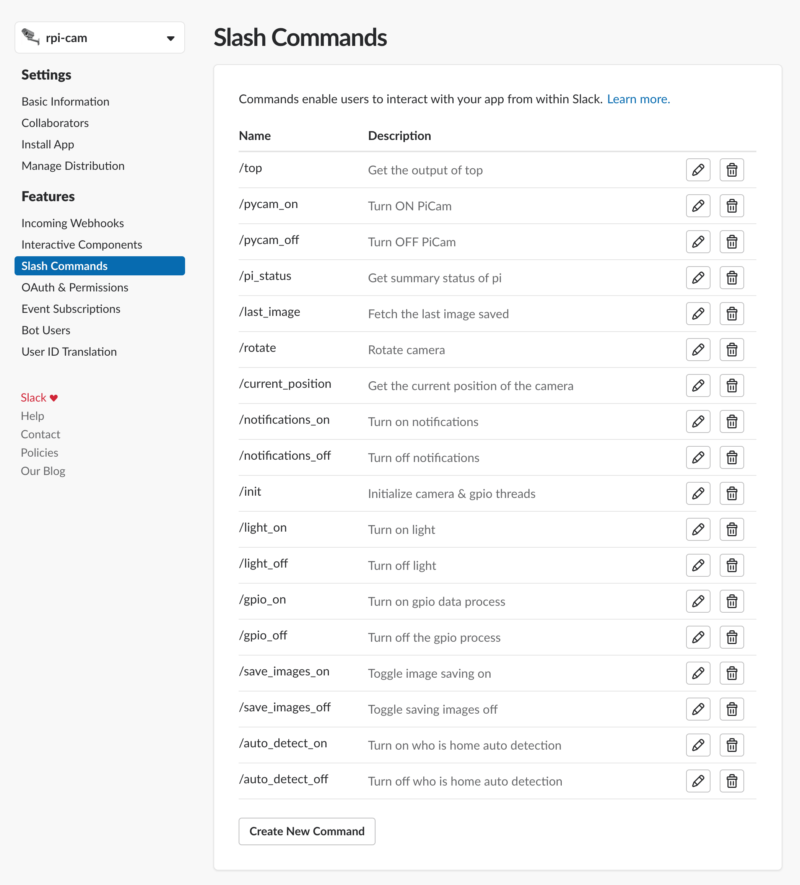
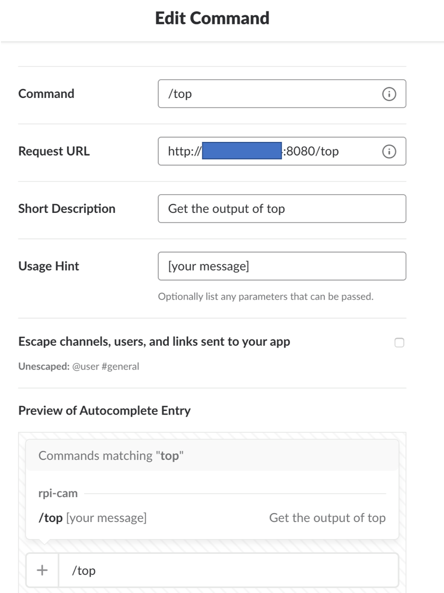
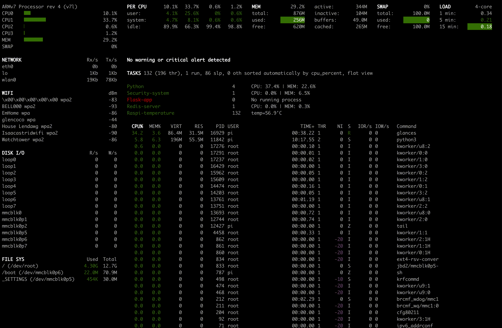

# rpi-security-system


Hacking a home security system with a raspberry pi + Python.

## Setup

### Raspberry Pi Setup & OpenCV Installation
Checkout out my [rpi-setup](https://github.com/ian-whitestone/rpi-setup) repo for details on how I configured my raspberry pi.

In particular, look at the [camera](https://github.com/ian-whitestone/rpi-setup#camera-tings) section to see installation instructions for `OpenCV 3.4.3`, the raspberry pi camera, and Pimoroni's pantilthat.


### Python Dependencies

See `requirements.txt` for the python dependencies:

`pip install -r requirements.txt`

### Port Forwarding

You will need to open up some ports on your router in order to route slack requests, or requests for other pages webpages on your pi, to the local IP address of your pi. Every router will be different, but here is my setup:



This allows any devices on my local network to SSH into the raspberry pi. It also opens up two ports on my router, `8088` and `8080`, and forwards traffic to the corresponding ports running on my raspberry pi.

### Slack

Follow [Slack's great documentation](https://api.slack.com/slack-apps) for how to build an app.

Once built, manage/find your app at `https://api.slack.com/apps`.

I added a bunch of slash commands:



Here's one example of a slash command setup:



I also added an interactive component to allow for image tagging. You just need to specify the request URL for this, i.e. `http://<your_ip_address>:8080/interactive`

### Redis

Followed instructions from this [blog post](http://mjavery.blogspot.com/2016/05/setting-up-redis-on-raspberry-pi.html).

**Note:**
this line: `sudo cp utils/redis_init_script /etc/init.d/redis_6379`
should be: `sudo cp utils/redis_init_script /etc/init.d/redis`

As pointed out by someone in the comments.

### Glances

**Config File**

`/home/pi/.config/glances/glances.conf`

```
[amp_python]
enable=true
regex=.*python.*
refresh=3
countmin=1

[amp_security-system]
enable=true
regex=.*security_system.*
refresh=3
countmin=1
countmax=1

[amp_flask-app]
enable=true
regex=.*run_flask.*
refresh=3
countmin=1
countmax=1

[amp_redis-server]
enable=true
regex=.*redis-server.*
refresh=3
countmin=1
countmax=1

[amp_raspi-temperature]
enable=true
regex=.*
refresh=3
command=vcgencmd measure_temp
countmin=1
```

Here I have some specific processes/things I am monitoring:

1) All python processes
2) Security system python process
3) Flask app python process
4) Redis Server
5) Raspberry Pi Temperature (along with total number of running processes)

The result is a pretty slick dashboard. You can see I don't have a flask process running, which is flagged in red due to the `count_min=1` constraint in the config.



**Setting Up a Password**

```
>>> glances -w -p 52962 --disable-plugin docker --password
Define the Glances webserver password (glances username):
Password (confirm):
Do you want to save the password? [Yes/No]: yes
Glances Web User Interface started on http://0.0.0.0:52962/
```

**Running Glances Webserver**

`glances -w -p 52962 --disable-plugin docker --password`

Login with username `glances` and the password you set...

**Monitoring Glances Log File**

`tail -f /tmp/glances-pi.log`

**References**
- https://glances.readthedocs.io/en/stable/index.html
- https://www.maketecheasier.com/glances-monitor-system-ubuntu/

### Credentials

`app/config/private.yml`

```yaml
ian_uid: XXXXX # id of the user I allow to make slack requests
alerts_channel: XXXX # channel ID (named alerts), where messages are posted to

rpi_cam_app:
  bot_token: xoxb-XXXXX-XXX # get this from https://api.slack.com/apps/<your_app_id>/oauth? 
  verification_token: XXXXXX # get this from app homepage: https://api.slack.com/apps/<your_app_id>
```

## Usage

```bash
cd rpi-security-system
gunicorn -c gunicorn.conf run_flask
```

## Architecture

Coming soon...

## Demo


## Resources

1) [Open CV Installation](https://www.pyimagesearch.com/2016/04/18/install-guide-raspberry-pi-3-raspbian-jessie-opencv-3/)
2) [General camera usage](https://www.pyimagesearch.com/2015/03/30/accessing-the-raspberry-pi-camera-with-opencv-and-python/)
3) [Intro to Motion Detection](https://www.pyimagesearch.com/2015/05/25/basic-motion-detection-and-tracking-with-python-and-opencv/)
- Note - uses webcam instead of picam
- see [here](https://www.pyimagesearch.com/2016/01/04/unifying-picamera-and-cv2-videocapture-into-a-single-class-with-opencv/) to switch between the two
4) [Motion detection system](https://www.pyimagesearch.com/2015/06/01/home-surveillance-and-motion-detection-with-the-raspberry-pi-python-and-opencv/)
5) https://api.slack.com/slack-apps
6) [Flask Video Streaming](https://blog.miguelgrinberg.com/post/flask-video-streaming-revisited)
